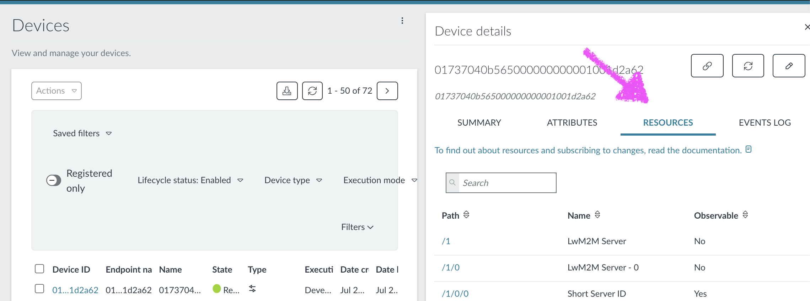

# pelion-dm-example-ra6m3-e2-studio
Pelion Device Management example for Renesas EK-RA6M3 e2 studio project

## Setup
### Install software
* Download the FSP with e2 studio Installer  
https://github.com/renesas/fsp/releases/download/v1.2.0/setup_fsp_v1_2_0_e2s_v2020-04.exe
* Download SEGGER J-Link software  
https://www.segger.com/downloads/jlink/#J-LinkSoftwareAndDocumentationPack

### Create Pelion Device Management account and developer certificate

* Signing up or logging in to Device Management Portal  
https://www.pelion.com/docs/device-management/current/user-account/index.html

* Creating and downloading a developer certificate (`mbed_cloud_dev_credentials.c`)  
https://www.pelion.com/docs/device-management/current/provisioning-process/provisioning-development-devices.html

## How to import/build the example project

### Import the example project
* Launch e2 studio
[File] - [Import] - [General] - [Existing Projects into Workspace]
Click [Next >] button 
* [Select this archive file] and browse the zip file
Click [Finish] button

### Build the project
* Open `configurations.xml` in the project
Click [Generate Project Content] to generate code
* Copy your Pelion developer cirtificate file {project}\pdmc\mbed_cloud_dev_credentials.c
* Click Build button to compile/link the project

### Setup EK-RA6M3 hardware
* Connect USB cable between host PC and DEBUG USB port (J10) of EK-RA6M3
* Connect Ethernet cable

### Debug the project
* Launch J-Link RTT Viewer application
  * Connection to J-Link - USB
  * Specify Target Device - R7FA6M3AH
  * Target Interface & Speed - SWD, 4000 kHz
  * RTT Control Block - Auto Detection
* Click [OK] button to connect the target

* Back to e2 studio IDE
* Click [Debug As...] button
* Select [Renesas GDB Hardware Debugging]
Click [OK] button 
* Choose the [Pelion_DM_example.elf] binary
Click [OK] button 
* Select [J-Link ARM] for debug hardware
Click [OK] button 
* Select [R7FA6M3AH] device
Click [OK] button 
* The Pelion_DM_example.elf binary is flashed to the target board 
* Confirm Perspective Switch - click [Yes] button 
Click [Resume] button to run the program 

### Browse your device resource from portal

* Open Pelion Device Management portal page  
https://portal.mbedcloud.com/
* Select your device from Device directory  
https://portal.mbedcloud.com/devices/list  

* Click `RESOURCES` tab

* Click `/3200/0/5501` resource (button_resource)

## See also

Pelion Device Management document  
https://www.pelion.com/docs/device-management/current/welcome/index.html

Command-line tutorial for Renesas SDK with Pelion Device Management  
https://www.pelion.com/docs/device-management/current/connecting/renesas-sdk.html
